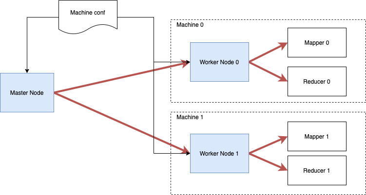
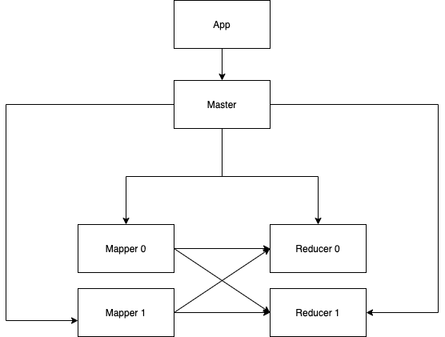

## Introduction
This documentation covers the design and implementation details of a framework for MapReduce. This framework provides two simple interfaces: `map` and `reduce` for applications and is able to launch applications to run in parallel on either on a single machine or a cluster of machines. The underlying communication in this framework utilizes [gRPC][grpc] in Java [`netty` framework][netty], which provides asynchronous network communication.

The assignment covers the distributed components for MapReduce with the following features:
### Features
* Protobuf definition for RPC requests, responses and services.
* Muti-nodes resource management via Master Worker design for a cluster of machines or a pseudo cluster mode on a single machine.
* Streaming communication support via gPRC

## Design of Components

In this framework, four major components are designed and implemented to the distributed system.
1. Master: responsible for managing Workers and cluster setup for each run of applications. It also exposes APIs for applications.
2. Worker: responsible for managing computation resources for each physical machine in a cluster. It manages `Mapper`s and `Reducer`s that run on the same machine with the `Worker`.
3. Mapper: is an abstract concept that runs a `Map` task.
4. Reducer: is an abstract concept that runs a `Reduce` task.

||
|:--:|
|*Figure 1: Resource Management*|

Figure 1. shows the message communication between `Master` and `Worker`s on two machines respectively. Each worker launches one mapper and one reducer according to the request from applications.

||
|:--:|
|*Figure 2: Workflow*|

Figure 2. illustrates the data workflow of a typical MapReduce application. Firstly, `App` sends a request to `Master` for two `Mapper`s and two `Reducer`s. Then, `Master` instructs all `Worker`s in the cluster to fulfill this request via a round-robin resource scheduling algorithm.  In this figure, two `Mapper`s and two `Reducer`s are launched by `Worker 0` and `Worker 1` respectively. During the stage of `map`, all `Mapper`s run to consume input files. During the stage of `reduce`, all `Reducer`s pull data from `Mapper`s and produce the final results.

## RPCs and Protobufs

All RPC services are defined in files under `src/main/proto`.

RPC servers for each components:
* Master
  * initCluster
  * runMapReduce
  * destroyCluster
* Worker
  * startMappers
  * stopMappers
  * startReducers
  * stopReducers
* Mapper
  * runMapper
  * stopMapper
  * readCombinedKeyValues
* reducer
  * runReducer
  * stopReducer


## Example applications

### WordCount

The word count application source code can be found in
`src/main/java/io/github/bfeng/simplemapred/app/WordCountApp.java`. The `map` task emits `<word, 1>` pairs. The `reduce` task receives `<word, list>` pairs and then emits `<word, total>`.

### InvertedIndex

The inverted index application source code can be found in `src/main/java/io/github/bfeng/simplemapred/app/InvertedIndex.java`. The `map` task emits `<word, file>` pairs. The `reduce` task receives `<word, list of files>` pairs and then `<word, all found files>`.

## Test cases
Please note `Master` and `Worker` share the `machines.conf` file for the configuration of a cluster. Each line of the file defines a configuration, following a format `master:<host>:<port>:<home>` or `worker:<host>:<port>:<home>`. In a pseudo cluster environment, the `<host>` can be "localhost" but '<port>' must be different. `Master` and `Worker` hang in the foreground of terminal. So each server runs in a separated terminal.

1. Start `Master`:
  ```
  java -cp target/simple-mapred-1.0-SNAPSHOT-jar-with-dependencies.jar \
     io.github.bfeng.simplemapred.resource.Master \
     src/main/resources/machines.conf
  ```
2. Start `Worker` on each machine in a cluster (worker id must be specified):
  ```
  java -cp target/simple-mapred-1.0-SNAPSHOT-jar-with-dependencies.jar \
    io.github.bfeng.simplemapred.resource.Worker \
    src/main/resources/machines.conf 0
  ```

3. Run applications:
  ```
  # WordCount
  java -cp target/simple-mapred-1.0-SNAPSHOT-jar-with-dependencies.jar \
     io.github.bfeng.simplemapred.app.WordCountApp localhost:12345 \
     input/words-1.txt,input/words-2.txt output/wc-1.txt,output/wc-2.txt
  ```

  ```
  # Inverted index
  java -cp target/simple-mapred-1.0-SNAPSHOT-jar-with-dependencies.jar \
     io.github.bfeng.simplemapred.app.InvertedIndex localhost:12345 \
     input/words-1.txt,input/words-2.txt output/ii-1.txt,output/ii-2.txt
  ```
  Please note: above two applications accept a list of files delimited by comma as input and a list of files delimited by comma as output. Thus, any number of input files and any number of output files are accept by the framework. For example, `WordCount` accepts `input/words-1.txt` and `input/words-2.txt` as input and produces results in `output/wc-1.txt` and `output/wc-2.txt`. One can also specify two files as input and one file as output.

4. Run application with larger files as input:
  ```
  # WordCount
  java -cp target/simple-mapred-1.0-SNAPSHOT-jar-with-dependencies.jar \
     io.github.bfeng.simplemapred.app.WordCountApp localhost:12345 \
     input/part-1.txt,input/part-2.txt output/wc-1.txt,output/wc-2.txt
  ```

  ```
  # Inverted index
  java -cp target/simple-mapred-1.0-SNAPSHOT-jar-with-dependencies.jar \
     io.github.bfeng.simplemapred.app.InvertedIndex localhost:12345 \
     input/part-1.txt,input/part-2.txt output/ii-1.txt,output/ii-2.txt
  ```

5. Shutdown servers:

  Both `Master` and `Worker` accepts `Control-C` as a shutdown signal.

[grpc]: https://grpc.io/
[netty]: https://netty.io/
